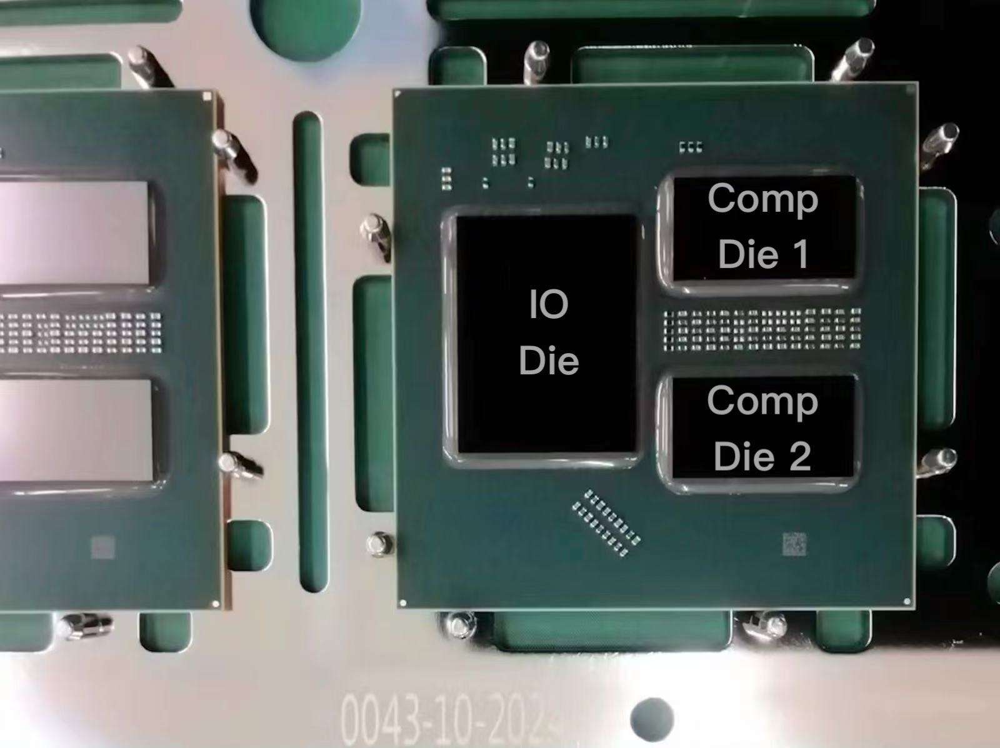
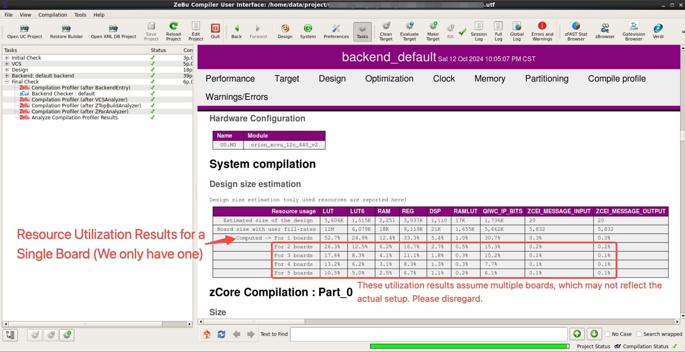

# Open-source Overview and Plan

We have done our best to obtain authorization to open-source many files that showcase the workflow of the end-to-end Gemini-based compiler developed for our high-performance commercial AI accelerator, the ZEBU FPGA-based Verification Platform and corresponding results. While we are currently unable to release the full source code due to IP flow restrictions, we believe these materials and documentation effectively demonstrate our Gemini-based compiler and providing insight into the entire workflow. `Additionally, **we commit to setting up a small-scale cloud platform** once the paper is accepted and the chip tape-out is complete. This platform will allow users to not only access the open-sourced Gemini scheduler but also modify or even replace our scheduler (as long as the output is converted to IR format), enabling it to be translated into instructions executable on the chip.`

# Tensor-shuttle-based Compiler Workflow Overview

This document outlines the workflow of our compiler. The initial input supports networks in TFLite, PyTorch, and ONNX formats. After frontend processing—including quantization and basic fusion (e.g., CONV+BN+ReLU)—it outputs the Frontend IR. Next, the Gemini Scheduler performs global optimization, generating the Scheduler IR, which includes explicit address optimizations as noted. Finally, the Assembler converts the IR into instructions for deployment on the chip. Since our chip just recently completed tape-out and is still in the testing phase, we will release some actual measured data later. Therefore, we are showing the results from the ZEBU platform and the **Package Shot** (shown below), where the package shot highlights one IO Die and two compute Dies.

The workload example we use is an **INT8-quantized ResNet50, ResNet34, and YOLOv3** with a **batch size ranging from `1 to 64?`**. The platform is a **single-core, 8 TOPS** computing power scaled-down accelerator (due to ZEBU resource limitations, simulating one core with a single board already exceeds 50% LUT resource utilization). For a more detailed hardware synthesis log of the ZEBU, please refer to [backend_log](./ZeBu_files/backend_default_globalLog.log).

## Workflow

### 1. **Frontend Processing**
   - **Input**: ONNX, Pytorch, TFLite model (A ResNet-50 ONNX example is located in [`model_input/`](./model_input/))
   - **Output**: Frontend IR (located in [`frontend_output/`](./frontend_output/))
   - **Process**: 
     - The first step in the compiler workflow is to convert the ONNX model into a Frontend IR, which includes quantization and basic fusion (e.g., CONV+BN+ReLU). This IR contains all layers, operations, data types, and dependencies required for further processing by the scheduling and assembly stages.
   
### 2. **Gemini Scheduler**
   - **Input**: Frontend IR (from [`frontend_output/`](./frontend_output/))
   - **Output**: Scheduler IR (located in [`scheduler_output/`](./scheduler_output/))
   - **Process**:
     - Gemini reads the Frontend IR and performs the optimization introduced in the paper. Once scheduling is complete, the system uses the IRgen tool to generate the Scheduler IR, which is a custom high-level intermediate representation. This decouples it from low-level instruction generation, facilitating continued optimization or even replacement of the scheduler.

### 3. **Assembler**
   - **Input**: Scheduler IR (from [`scheduler_output/`](./scheduler_output/))
   - **Output**: Assembly Instructions (located in [`assembler_output/`](./assembler_output/))
   - **Process**:
     - The assembly generation phase involves parsing the Scheduler IR and translating it into a series of assembly instructions. These instructions represent the final executable form that will run on the target hardware. Each instruction contains detailed information on data movement, computation, and control flow.

### 4. **ZEBU**
   - **Input**: Assembly Instructions (from [`assembler_output/`](./assembler_output/))
   - **Output**: Execution times for each instruction (located in [`zebu_trace_output/`](./zebu_trace_output/))
   - **Process**:
     - The assembly instructions can be executed on the ZEBU platform, where we integrated a specialized trace capture hardware mechanism in our accelerator to record the start and end times of each instruction and read them out. The validation we conducted in Sec. V-E is also based on this trace data.

## Understanding the IR Formats

Each stage of the process produces an IR that follows a specific format. For detailed information on the content and structure of these IRs, refer to the `*_Format.md` file located in each of the output directories:

- [`frontend_output/Frontend_IR_Format.md`](./frontend_output/Frontend_IR_Format.md)
- [`scheduler_output/Scheduler_IR_Format.md`](./scheduler_output/Scheduler_IR_Format.md)
- [`assembler_output/ISA_Format.md`](./assembler_output/ISA_Format.md)
- [`zebu_trace_output/ZeBu_Trace_Format.md`](./zebu_trace_output/ZeBu_Trace_Format.md)

These documents provide comprehensive explanations of the fields and structures used in the respective IRs.

## Folder Structure

- **[`frontend_output/`](./frontend_output/)**: Contains the quantized Frontend IR.
- **[`scheduler_output/`](./scheduler_output/)**: Contains the Scheduler IR generated by Gemini and IRgen.
- **[`assembler_output/`](./assembler_output/)**: Contains the final assembly instructions.
- **[`zebu_trace_output/`](./ZeBu_trace_output/)**: Contains the execution time logs from the Synopsys ZeBu Emulation System.

By following this structured pipeline, our compiler efficiently transforms models into hardware-executable instructions.
